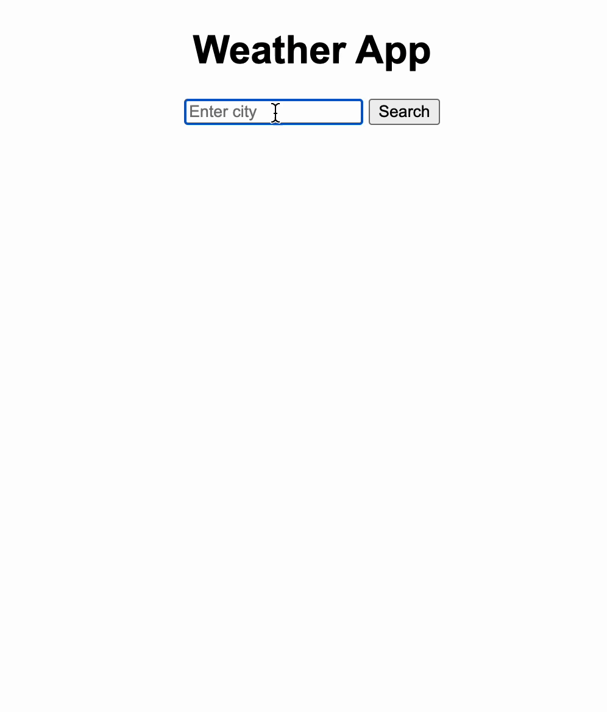
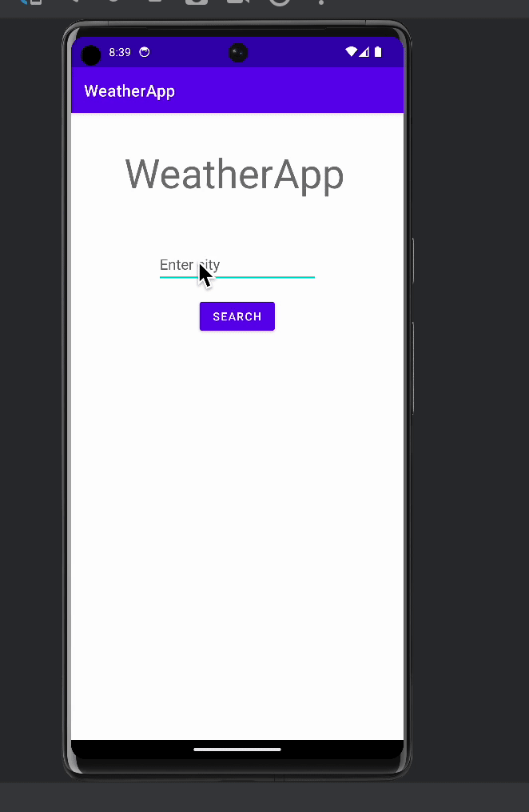

# Weather_App

This is a simple app that uses the WeatherAPI to get the current temperature of a city that the uses inputs. Additionally, depending on the temperature, the background color of the app will change. This was done in two parts: web and android studio. The web version was my first time doing anything with HTML so it is rather basic. For this one, rather than the background color changing based on the temperature, it changed on the weather condition (sunny, cloudy, rainy, etc.).  After I had completed this, I decided to try to replicate it using Android Studio. This project taught me the basics of how to use APIs and how to change aspects of the design based on user input and information recieved. 

## Web Version

 
  <kbd>
    
  </kbd>

## Android Studio Version

 
  <kbd>
    
  </kbd>

